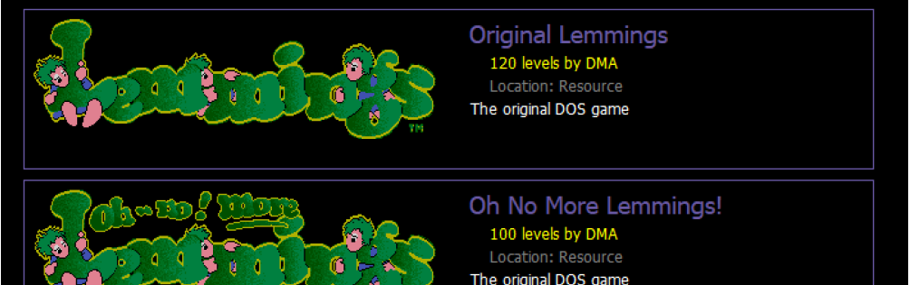
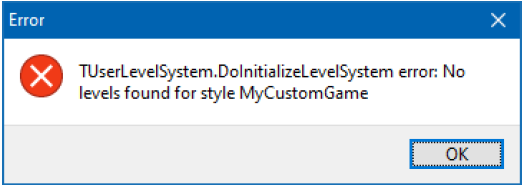
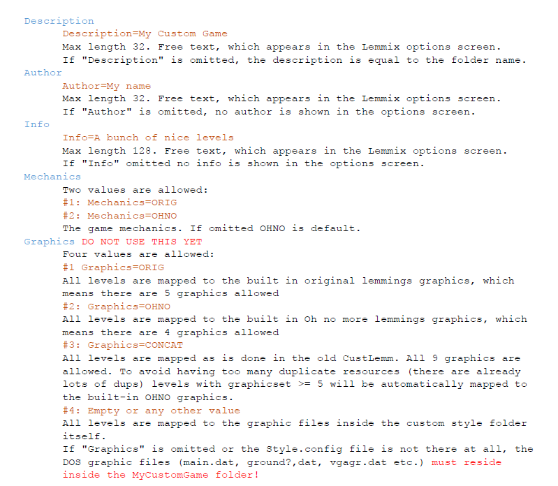

# Last release (2.0 Beta) [here](https://github.com/ericlangedijk/Lemmix/releases/tag/2.0)

# Lemmix 2.0 Beta
###### March 2020

# FAQ
### What are the keyboard shortcuts?
They are described [here](#keyboard-in-game)
### What if I can't finish a level? Can I continue?
See the Cheating section, [here](#cheating)
### Can I toggle sound effects off and still have music on?
Yes, use `s` to toggle sound effects and `m` to toggle music

## Intro

After 15 years LemmixPlayer is changed. Enhanced and modernized. In short:

- LemmixPlayer is renamed to simply Lemmix. If I ever rewrite the editor it will be
    named LemmixEditor.
- All old DOS-games are included as resource inside the `exe`.
- Custom games can be added by adding new directories in the `Data\Styles` folder.
- A new options screen with all available games.
- New version of `bass.dll.`

When beta phase is over all source code will be on github. Please report issues and
suggestions on github.

## Options screen

From the menu screen press `F4` and this screen will appear. From here you can select the
 game you want to play.   
 

## Adding custom games

When starting up, Lemmix looks into the `Data\Styles\` folder for custom styles.
To add a custom game we have to follow some steps.

### 1. Create a folder  
When adding a style "*MyCustomGame*"  we first have to create a sub-folder.
Create a folder `.\Data\Styles\MyCustomGame`.
If the folder is entirely empty Lemmix will terminate with this message:

The following custom folder names are ignored by Lemmix, because these names are used
internally: `Orig`, `Ohno`, `H93`, `H94`, `X91`, `X92`. Do not use these names. The maximum length of a folder name is 64.

### 2. Add an optional config file

Inside `.\Data\Styles\MyCustomGame` you can optionally add a `Style.config` file. This is a
simple text file with some name+value pairs. All entries are optional. An example can
be seen in the `Conway` levels folder as shipped with this beta version.

The easiest way to test a new style is to copy a complete original DOS game inside a
new folder. But please be aware that ordering of levels is not following the original.
The insane ordering inside the original lemmings is only followed in the built-in
games. If there are levels with special graphics (the big ones: `vgaspec?.dat`) be sure
to include them as well.

###  3. Add the levels
This can be done in three ways:
- ####  3.1 `.LVL`-files
copy .LVL files to the MyCustomGame folder. These are seperate (already decompressed) level-files of 2048 bytes. Lemmix searches for these files by alphabet and will order them inside the game this way. The files have to have a .LVL extension.
- ####  3.2 `.DAT`-files
copy .DAT files to the MyCustomGame folder. These are the original compressed level-files as used in the original DOS game. The .DAT files have to conform to the wildcard searchmask *VEL*.DAT (case-insensitive). Lemmix searches for these files and sorts them by alphabet. The levels inside will be sorted as they appear in the file.
- ####  3.3 Mix of `.DAT`- and `.LVL`-files

  >Not recommended, but possible. You can put a mixture of `.DAT` and `.LVL` files in your style folder. Lemmix will first look at `.DAT` files and after that at `.LVL` files. And this is the way they are ordered.

  The number of levels is not limited by Lemmix. In all cases Lemmix puts the levels inside 4 sections. If Lemmix finds 600 levels there will be 150 levels in each section. `ODDTABLE.DAT` is ignored.

## Folders

Lemmix uses the following folders to read and write data:  
Cache-folder : `.\Cache `  
Styles-folder : `.\Data\Styles\xxx  `  
Replay-folder : `.\Output\Replay  `  
Screenshots-folder : `.\Output\Screenshots  `

## Caching

Lemmix caches some stuff inside the `.\Cache` folder. It tries to stay in sync with the
style folders. The cache stores level-titles, level-codes and in the style + section +
levelindex. This way Lemmix can very quickly find levelcodes and replayfiles.

## Levelcodes

Levelcodes are now created from a MD5 hashkey created from the raw LVL data. Lemmix
caches all these hashkeys and will be able to find every level of every game. Of course
there can be duplicates.

## Replaying and replay files

Lemmix created and creates replayfiles with the extension `.lrb`. If you open these files
with Lemmix and bind the extension in Windows, you can double-click on the file in
Windows Explorer and Lemmix opens at the correct level.
The replay file is upgraded to version 2. Extra information is added: the hashkey of
the level.

**Be aware that – when replaying – any click on a skillbutton or clicking inside the
level will truncate the replayed file and you are in control of the game again.**
Clicking in the minimap, pausing and scrolling is allowed without regaining control.

## Opening LVL files

Directly opening a `.LVL`-file is possible too because of the Lemmix internal cache
system. Open the file with Lemmix and it will startup with that level.

## Config and options

### Keyboard in-game

`F1`..`F12` : select skillbutton (`F12` must be hit twice for safe nuking)  
`Ctrl` + `F1` : go to minimum release rate at once (only during pause)  
`Ctrl` + `F2` : go to maximum release rate at once (only during pause)  
`Esc` : stop playing   
`⮠` Enter : add savestate   
`⭠`Backspace : go to last savestate   
`→` Right arrow : scroll right   
`←` Left arrow : scroll left   

`5` : cheat solve level   
`+` or `=` : turn music volume up   

`-` or `_` : turn music volume down  
`Spacebar` : jump 10 gameseconds    
`Shift` + `Spacebar` : Go back 10 gameseconds   

`b` : Save current game to png to Screenshots folder.   
Also copy the screenshot png to the Windows clipboard.   
This will include any game-messages.   
`f` : Toggle fast forward   
`F` (`SHIFT` + `f`) : Jump one minute   
`l` : Load replay   
`m` : Toggle music   
`n` : If game paused then go one frame further   
`p` : If game paused then go one frame back   
`r` : Replay game   
`u` : Save replay to Replay-folder with default name   
`o` : Save current replayfile (if we loaded on) to new version.   
Original filename is left intact but folder is the default folder `.\Output\Replay.`  

## Cheating

Of course we need to cheat during beta. So let us add a few lines to Lemmix.Config:  
- `Misc.UseCheatCodes=1`  
allows you to enter sectionname + levelnumber inside the levecode screen  
- `Misc.UseCheatKeyToSolveLevel=1`  
allows to cheat the level inside the game screen bij pressing "`5`"  
- `Misc.UseCheatScrollingInPreviewScreen=1`  
allows to scroll through al levels in the preview screen using the `← →` arrow  keys.  

## Code changes

- Internal coding reworked, cleaned up, and optimized code for newer delphi
    versions. Lots of renaming units. Lots of moving around stuff. Lots of renaming
    variable names.
- Use '`for in`' loops and optimized this for all objectlists.
- Removed all '`with`' statements.
- Forcing use of complete enumeration-names for better readability.
- Removed a lot of virtual style stuff which was 'inherited' from the old lemmix
    editor.
- Reworked all `@designtime` forms to `@runtime` creation.
- Resources are better organized.
- Resources use zipfiles instead of my old 'archive'.
- Graphics32 library included. But only the necessary files.

## Functional changes

- Lemmix includes all the 6 dos-games as resource. All 6 games can be played with
    this one program.
- Game mechanics are (for now) left 100% intact compared to the old LemmixPlayer.
- New options screen to select a style (default + custom).
- All output files are saved to the `.\Output` folder.
- Cursor position is now always updated during scrolling.
- Lemmix uses a cache inside a `.\Cache` folder for all styles. Obsolete caches are
    automatically removed. Lemmix tracks if a custom style directory has been changed
    by checking the last-write-time. If the directory was changed a new cache is
    built.
- Show (optional) the texts "replaying" or "replayed" when a replayfile is playing
    or has played. Only when no lemming under the cursor.
- In-game (optional) feedback messages during replay like 'printscreen' or 'level
    saved'.
- Pressing "`b`" in game saves the a screenshot to png-file
- New `bass.dll`, which must be in the same directory as LemmixPlayer. Otherwise
    Lemmix will not start. Not included as resource anymore.
- The volume of the music can be set in-game. more volume: "`+`" or "`=`", less volume:
    "`_`" + "`-`".
- `inifile` has been renamed to a `config` file. More options (and some secret ones).
- Changed the levelcode system. no more randomizing but hashing. Levelcodes are
    created from a MD5 hash of the LVL file.
- Abandoned the "LookForLVLFiles" option, because custom styles has enough
    flexibililty.

## Todo

- Compare neolemmix for technical glitches / bugs / corrections.
- Enabled levelcode screen (optionally) to switch style.
- Optionally silently convert replayfiles with levelhash / new version. With "o"
    overwrite keypress rewrite the replay with the new version (hash included)
- Optionally directly go from levelcode screen to previewscreen
- Copy paste levelcode in levelcodescreen (10 chars)
- Optionally no blinking in levelcodescreen.
- Optionally autosave gameplay if succesful (or always).
- Fix some glitches as mentioned in the lemmingsforum (checkinteractiveobjects: it
    must be added to the gamemechanics)
- Option: if different mechanics in replay: allow or not allow. put in config!
- Support custom lemmings (in progress). build a cache to speed up. also use a
    custom levelcache and change replaystructure for better finding the levels
- Check out musics [http://www.vgmpf.com/Wiki/index.php/Lemmings_(DOS)](http://www.vgmpf.com/Wiki/index.php/Lemmings_(DOS))
- Stretched property of basescreen: use only 1 or 2 or 3 zoom etc. for sharpness
- Pixelcombiner class + make the event a static procedure in GR32.
- Change transparent black color to R,G,B = 0,1,0 instead of using a mask
- Game messages disappearing with alphablend
- More sophisticated photoplash effect during replay
- Keydown enter eat windows beep
- Escape repeats fading out
- Prepare for github
- Check if top of screen mouse clipt is always correct.
- Rework fadeout.
- High dpi testing and support.
- Switch monitor by hotkey
- Better error handling
- Make toolbox for extracting data etc.
- Optional graphic options: highlight stuff + hint on mouseover
- Optional show number of lemmings to be saved (xx) in previewscreen
- Optional show number of lemmings saved instead of %
- Optional feedback in-game about saving lemmings.
- Optional colorize fonts in screens / skillpanel.
- Only regain control when clicking on a lemming when inside the level
- Rework resources. Optional or not optional.
- Support for other music than mod files
- Support for different sounds
- Better stretching of graphics.
- Add an in-game replayfile browser screen
- Add a level by title search screen
- Use (optional) mechanics of replayfile to overwrite defaults

### Conway levels

If you want the Conway levels, unzip them into a subfolder of Lemmix: `Data\Styles\Conway\`

### Source code (in Delphi) will be added later
